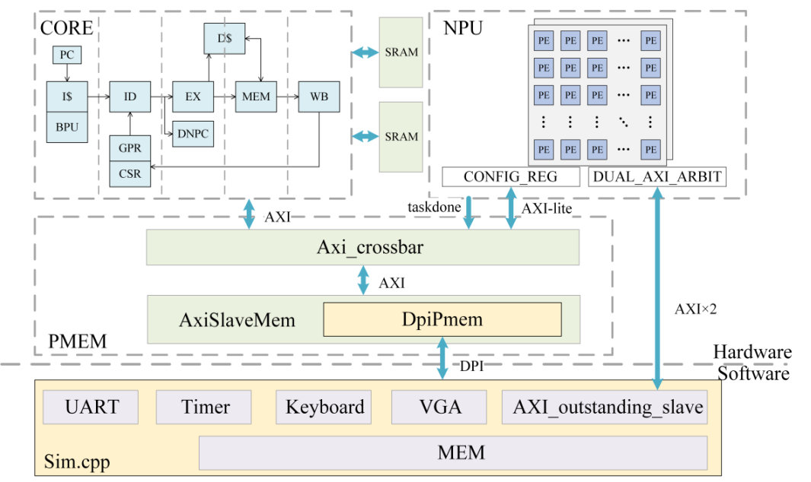
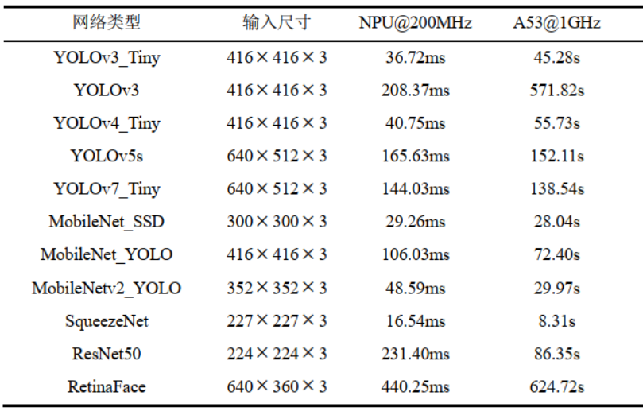

# ConSci-NPU-v1.0：专注CNN推理加速的自研NPU

本项目由**西安交通大学微电子学院梁峰教授课题组**联合设计与实现，采用Chisel HDL / Verilog / C++等多种语言协同开发。

**本项目的创新点包括：**

- 广泛适配主流基础算子，支持多种常见CNN网络模型；
- 实现软硬件协同的数据流配置优化，提供完整的模型转换与部署工具链；
- 支持Float32与Int8多精度复用的MAC IP设计，提升算力利用率与灵活性。


## 架构设计

NPU整体架构数据流图如下所示，核心计算单元由 GEMM 模块和 ALU 模块组成。

GEMM 模块基于脉动阵列原理实现矩阵乘法的加速，该阵列由 32× 32 个 PE 单元构成，每个 PE 单元可以在单周期内完成两组 `INT8` 的 MAC 计算。 


## 安装与使用说明

1. 克隆仓库：
    ```bash
    git clone https://github.com/yourusername/yourproject.git
    cd ACCEL1.0
    ```
2. 安装依赖：

    本项目使用Chisel HDL生成核心设计代码，其中浮点运算部分依赖`Berkley-hardfloat`库。如需对`chisel_prj`项目进行修改，请先运行：
    ```bash
    cd berkeley-hardfloat
    sbt publishLocal
    ```

3. 参数配置文件：

    本项目**软件工具链**基于腾讯优图实验室开源项目 **ncnn** 进行二次开发。为兼容多种前端模型输入，推理引擎适配中采用了**独立的网络参数文件定义**，并支持**全套转换优化工具**用于模型转换。

    通过 `Net` 的 `load_param_mem` 和 `load_model_mem` 方法完成模型的加载，并根据 param 文件实例化多个 Layer 对象完成模型解析：

    ```cpp
    if (yolov5.load_param_mem(load_file_align("yolov5s_int8.param")))
        exit(-1);
    if (yolov5.load_model_mem(load_file_align("yolov5s_int8.bin")))
        exit(-1);
    ```

    > **说明：**  
    > - **param 文件**：用于网络结构和参数的配置  
    > - **bin 文件**：用于模型权重等参数的存储  

    以 **Yolov5s** 为例，参数文件的部分配置如下，主要包含**算子层类型、名称、配置、输入输出数据及 blob 名称**等：

    
   
    **（附：详细的网络参数配置手册）**
    > **注意：本NPU在硬件加速过程中，仅对卷积、深度卷积以及全连接层进行了 `INT8` 量化，其他算子层仍采用 `FP32` 格式进行网络推理。**
    >
    > 因此，在 `bin` 文件中会包含多种数据格式的参数。为便于区分，**每项参数的头部均采用 Tag 方式进行标识**，具体的数据格式与 Tag 的映射关系如下所示：


   | 数据格式   |    Tag 标识   |
   | :-------  | :------------: |
   | INT8      |  0x00000000    |
   | FP32      |  0x01306B47    |
   | FP16      |  0x000D4B38    |

    > 解析 `bin` 文件时，需根据 Tag 标识正确读取和处理对应格式的数据，确保推理过程的准确性和兼容性。


## 系统演示方案

本项目的系统演示流程简明如下：

- SD卡用于存储和读取模型、图片等数据；
- 支持摄像头实时视频流推理；
- 推理结果通过显示接口输出，便于观察。

整体流程自动化，操作简单，便于快速演示系统功能。


## FPGA原型验证

### 1. SoC搭建：

    本项目 SoC 的搭建采用 **米联客 ZYNQ UltraScale+ MPSOC 15EG 开发板**。原型系统 SoC 架构如下所示：

    - **软硬件系统** 通过 MPSOC 的 **双通道 HP 接口**，共享 **PS 侧 4GB DDR**，实现高效的数据交互。
    - 利用 **CPU 集成的 UART 和 SDIO 外设**，实现板级调试、信息打印、模型与图像的存储等功能。


    

    由于 NPU 采用**双通道 AXI**进行数据传输，并采用**单通道AXI_Lite**进行指令加载，因此三条独立总线需要搭配多个总线互联矩阵。

    SoC地址分配如下所示：

    

### 2. SoC资源占用
   
**SoC 系统中 PL 端资源使用情况如下所示：**
>
> - **查找表（LUT）资源**：约占用整体的 **1/3**
> - **触发器（FF）资源**：约占用整体的 **1/4**
>
整体来看，硬件系统资源占用合理，具备良好的扩展性和优化空间。
   
   
   
其中， Block RAM 和 DSP 消耗较大，主要用于 NPU 中缓冲区和乘法器的映射。


## NPU性能评估

**NPU 工艺与综合信息：**
>
> - 本 NPU 采用 **中芯国际 28nm 工艺**，基于 **SS 工艺角** 的标准库进行综合;
> - 目标频率设定为 **500MHz**，并**保留 20% 时序裕量**，确保时序收敛;
> - 综合后，**总面积为 `5.41 mm²`**。

该设计在保证高性能的同时，兼顾了面积与时序的优化，具备良好的工艺适应性和可扩展性。

### 1. 算子级性能分析

在 **200MHz** 时钟频率下，NPU GEMM 单元对 **卷积层算子** 的推理加速效果如下表所示，并与 **CPU 执行时间**进行了对比：


> **结论：**
>
> - 对于 CNN 网络中常见尺寸的特征图，**NPU 计算时间可控制在数千微秒及以下**；
> - 单核 **ARM A53** 则需数千至数万毫秒；
> - **NPU@200MHz 相比 A53@1GHz，性能提升约 2000 倍**。

对于 **深度卷积**，由于单个卷积核仅有一个通道，数据量较小，推理时 PE 利用率较低，因此硬件加速效果相对有限：


> **结论：**
>
> - 深度卷积场景下，**NPU 执行速度相比 A53@1GHz 约提升数十倍**；
> - 主要受限于 PE 利用率，仍显著优于传统 CPU 执行。


### 2. 网络级性能分析

下表展示了**常见 CNN 模型**在不同平台下的推理时间对比，涵盖**图像识别、目标分类、人脸检测**等应用场景：



**性能亮点：**

- 在 **NPU@200MHz** 平台下：
    - **YOLOv3_Tiny**、**YOLOv4_Tiny**  
        - 输入尺寸：`416 × 416` RGB 图像  
        - 推理速度：**25 FPS 以上**
    - **MobileNet**  
        - 输入尺寸：`300 × 300` RGB 图像  
        - 推理速度：**34 FPS 以上**
    - **SqueezeNet**（轻量级目标分类算法）  
        - 推理速度：**60 FPS 以上**

> 由此可见，NPU 在主流 CNN 网络上的推理性能显著优于传统 CPU 平台，能够满足多种实时视觉应用的需求。
    

## 目录结构

```plaintext
├── src/                                # 源代码目录
├── docs/                               # 文档资料
├── berkeley-hardfloat/                 # 依赖库
├── chisel_prj-1.0/                     # chisel工程
├── simulation_prj-axi_sim/             # 软硬件协同仿真工程
├── accel_sdk/                          # SDK文件
├── soc_display_fpga_250/               # FPGA工程
├── models/                             # 模型文件
└── README.md                           # 项目说明文件
```


## 贡献指南

欢迎提交 issue 和 pull request。请遵循 [CONTRIBUTING.md](CONTRIBUTING.md) 贡献指南。

## 许可证

本项目采用 [MIT License](LICENSE)。

**（添加许可证）**


## Ref

- [相关文档1](https://example.com)
- [相关文档2](https://example.com)

**（添加参考工程及文献）**

## 联系方式

如有问题请联系：

**（添加联系邮箱）**
